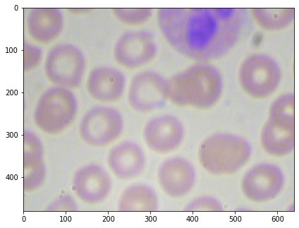
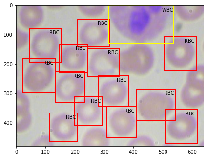

# Object-detection
Object localization and  detection 

We use BCCD Dataset in this task. It is a small-scale dataset for blood cells detection. 

You can download this dataset from [here](https://github.com/Shenggan/BCCD_Dataset).

As far as BCCD Dataset is concerned, the input images are microscopic level pictures,containing three classes of object,Red Blood Cells(RBC) , White Blood Cells(WBC) and Platelets.

And the output images are the same input images with bounding boxes detecting the presence of any of the above mentioned classes.

